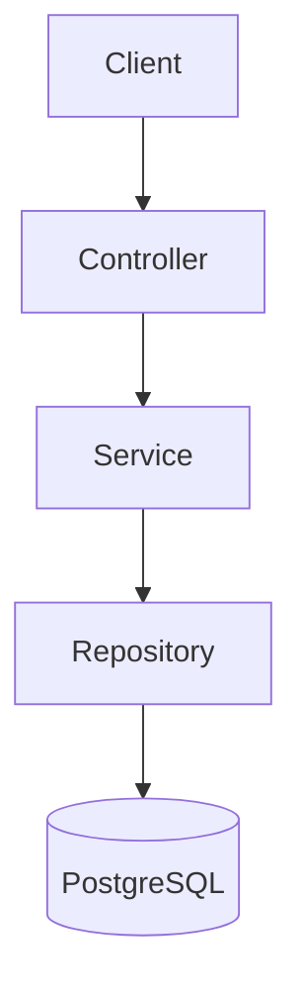
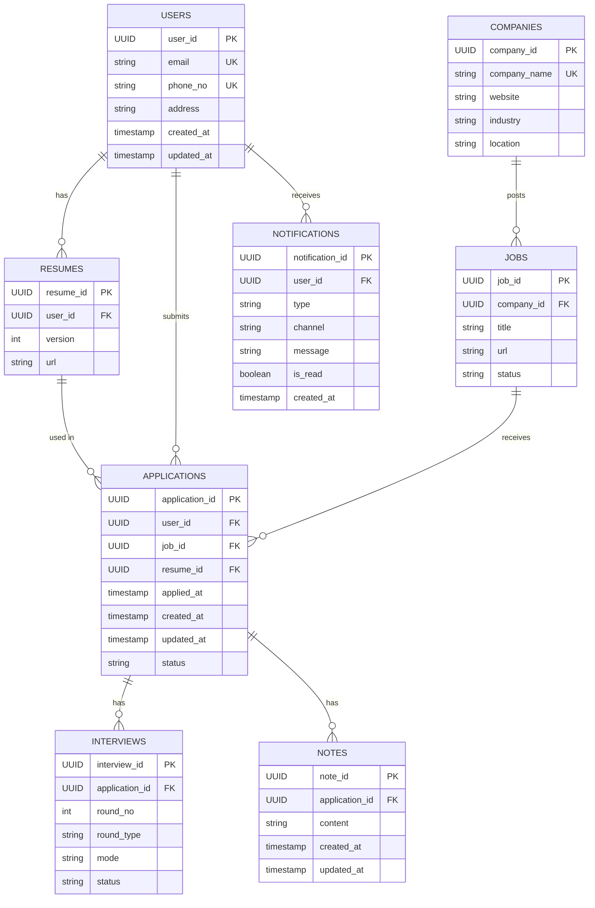
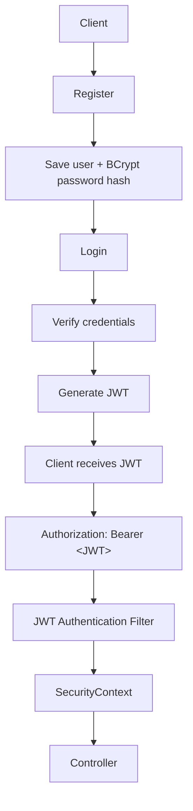

# CareerFlow

CareerFlow is a backend application for tracking and managing the job-search process. It gives a user one place to keep their companies, job openings, resumes, applications, interviews, notes, and notifications, exposed through REST APIs.

It is built with Java and Spring Boot as a portfolio project, to practice layered backend design, relational data modelling, validation, and error handling.

> **Project status: under development.** The core domain APIs are implemented and tested. Authentication and authorization (JWT) are **in progress**; only the Spring Security configuration foundation exists today. See [Authentication & Security](#authentication--security).

---

## Table of Contents

- [Features](#features)
- [Tech Stack](#tech-stack)
- [Architecture](#architecture)
- [Project Structure](#project-structure)
- [Database Design](#database-design)
- [REST API](#rest-api)
- [Authentication & Security](#authentication--security)
- [Validation](#validation)
- [Exception Handling](#exception-handling)
- [Business Rules](#business-rules)
- [Getting Started](#getting-started)
- [Testing](#testing)
- [Future Improvements](#future-improvements)
- [Engineering Concepts Demonstrated](#engineering-concepts-demonstrated)
- [Author](#author)

---

## Features

### Implemented and tested

- **Users**: user information management
- **Companies**: full CRUD
- **Jobs**: full CRUD, with job status (`OPEN`, `CLOSED`, `EXPIRED`)
- **Resumes**: create, retrieve, and delete, with per-user versioning
- **Applications**: full CRUD linking a user, a job, and a resume, with status tracking
- **Interviews**: create and retrieve, including retrieval by application
- **Notes**: full CRUD on notes attached to applications
- **Notifications**: create, retrieve (all, by ID, by user, unread by user), mark as read, and delete
- **Request validation** with Spring Validation
- **Centralized exception handling** with a consistent error response
- **Business-rule enforcement** in the service layer, backed by database constraints
- **Spring Security configuration foundation** (stateless, CSRF disabled, `/api/auth/**` intended to be public)

### In progress

- Registration, login, BCrypt password hashing, JWT generation/validation, and the JWT authentication filter
- Authorization and ownership checks based on the authenticated user

---

## Tech Stack

| Category | Technology |
|---|---|
| Language | Java 17 |
| Framework | Spring Boot 3.5.14 |
| Web | Spring Web |
| Persistence | Spring Data JPA, Hibernate |
| Database | PostgreSQL |
| Validation | Spring Validation |
| Security | Spring Security (configuration in progress) |
| Utilities | Lombok |
| Build tool | Gradle |

Package/group: `com.jobtracker.careerflow`

---

## Architecture

CareerFlow follows a layered architecture. Each layer has a single responsibility and depends only on the layer below it.



| Layer | Responsibility |
|---|---|
| **Controller** | Handles HTTP requests, maps request data to DTOs, calls the service layer, and returns API responses |
| **Service** | Contains business logic, performs validation and business-rule checks, coordinates repositories, and converts entities to response DTOs |
| **Repository** | Database access through Spring Data JPA |
| **Entity** | Represents database tables and their relationships |
| **DTO** | Separates API request/response models from persistence entities |
| **Exception** | Custom exceptions and centralized exception handling |
| **Config** | Application configuration, such as Spring Security |

---

## Project Structure

The code is organized by responsibility under the base package `com.jobtracker.careerflow`:

| Component | Purpose |
|---|---|
| `controller` | REST controllers for each resource |
| `service` | Business logic and rule enforcement |
| `repository` | Spring Data JPA repositories |
| `entity` | JPA entities mapped to PostgreSQL tables |
| `dto` | Request DTOs, update request DTOs, and response DTOs |
| `exception` | Custom exceptions and the `@ControllerAdvice` handler |
| `config` | Configuration classes, including `SecurityConfig` |

---

## Database Design

PostgreSQL is the primary database. Identifiers are **UUIDs**.

Main tables: `users`, `resumes`, `companies`, `jobs`, `applications`, `interviews`, `notes`, `notifications`.

### Entity Relationships



> The diagram lists the key fields only. Interview scheduling details are stored as implemented in the entity.

### Table notes

**users**
- `email` is unique; `phone_no` is unique and mandatory.
- A user can have multiple resumes, applications, and notifications.

**resumes**
- A resume must belong to a user.
- `version` must be greater than 0, and `url` is mandatory.
- The user/version combination is unique.

**companies**
- Company name is unique after trimming/normalization.

**jobs**
- A job belongs to a company.
- Status values: `OPEN`, `CLOSED`, `EXPIRED`.

**applications**
- Connects a user, a job, and a resume.
- Status values: `APPLIED`, `SCREENING`, `INTERVIEW`, `OFFER`, `ACCEPTED`, `REJECTED`, `WITHDRAWN`.
- A composite user/resume relationship is used at the database level so the resume referenced by an application belongs to the same user.
- A user can apply to a given job only once (unique user/job combination).

**interviews**
- Belong to an application; mode values: `ONLINE`, `PHONE`, `ONSITE`.
- Round types: `HR_SCREENING`, `TECHNICAL`, `SALARY_NEGOTIATION`.
- Deletion cascades from the application side according to the database design.

**notes**
- Belong to an application; a database constraint ensures trimmed content is not empty.
- Notes are deleted when their application is deleted.

**notifications**
- Belong to a user.
- Channels: `IN_APP`, `EMAIL`.
- Types: `INTERVIEW_REMINDER`, `APPLICATION_UPDATE`, `FOLLOW_UP`, `SYSTEM`.

---

## REST API

The API uses DTOs rather than exposing entities directly. Unless noted, the sections below list the supported operations for each resource.

> Authentication endpoints are intended to live under `/api/auth/**`, but they are **not yet implemented** (see [Authentication & Security](#authentication--security)).

### Users

User APIs exist for managing user information.

### Companies

| Operation |
|---|
| Create company |
| Get company |
| Get all companies |
| Update company |
| Delete company |

### Jobs

| Operation | Notes |
|---|---|
| Create job | |
| Get job | |
| Get all jobs | |
| Update job | Supports updating fields such as title and URL |
| Delete job | Rejected if applications exist for the job |

### Resumes

| Operation | Notes |
|---|---|
| Create resume | |
| Get resume | |
| Get resumes | |
| Delete resume | Rejected if the resume is used by an application |

### Applications

| Operation |
|---|
| Create application |
| Get application |
| Get all applications |
| Get applications by user |
| Get applications by job |
| Update application |
| Delete application (rejected if interviews exist) |

### Interviews

| Operation | Notes |
|---|---|
| Create interview | Validates that the application exists and that the interview round is not a duplicate |
| Get interview by ID | |
| Get all interviews | |
| Get interviews for an application | |

### Notes

Base path: `/api/notes`

| Method | Endpoint | Description |
|---|---|---|
| `GET` | `/api/notes` | Get all notes |
| `GET` | `/api/notes/id/{id}` | Get a note by ID |
| `GET` | `/api/notes/id/application/{id}` | Get notes for an application |
| `POST` | `/api/notes` | Create a note |
| `PATCH` | `/api/notes/updatenote/id/{id}` | Update note content (content only) |
| `DELETE` | `/api/notes/deletenote/id/{id}` | Delete a note |

### Notifications

Base path: `/api/notifications`

| Method | Endpoint | Description |
|---|---|---|
| `GET` | `/api/notifications` | Get all notifications |
| `GET` | `/api/notifications/id/{id}` | Get a notification by ID |
| `GET` | `/api/notifications/user/{id}` | Get notifications for a user |
| `GET` | `/api/notifications/user/{id}/unread` | Get unread notifications for a user |
| `POST` | `/api/notifications` | Create a notification |
| `PATCH` | `/api/notifications/id/{id}/read` | Mark a notification as read |
| `DELETE` | `/api/notifications/id/{id}` | Delete a notification |

### DTO design

- Separate **request**, **update request**, and **response** DTOs are used.
- Create and update operations can use different DTOs.
- Fields that must not change during an update are excluded from update DTOs. For example, the note update DTO contains only `content`, because `application_id` must not change.
- Relationships between application, user, and resume are validated in the service layer.

---

## Authentication & Security

**Status: in progress.** Spring Security has been added and its configuration foundation is in place. The authentication flow itself is not complete, and CareerFlow should not currently be treated as having working login or JWT authentication.

### Current state

| Item | Status |
|---|---|
| Spring Security dependency and `SecurityConfig` | Implemented (foundation) |
| CSRF disabled | Implemented (configuration) |
| Stateless sessions (`SessionCreationPolicy.STATELESS`) | Implemented (configuration) |
| `/api/auth/**` intended to be publicly accessible | Configured |
| Other API requests require authentication | Configured |
| Registration flow | In progress |
| BCrypt password hashing | In progress |
| Login and credential verification | In progress |
| JWT generation | In progress |
| JWT validation and authentication filter | In progress |
| `SecurityContext` population / authenticated user extraction | In progress |
| Authorization and ownership enforcement | In progress |
| Replacing client-supplied user IDs with the authenticated identity | In progress |

### Planned authentication flow

The intended design is stateless, using Bearer JWT authentication:



> Everything in this diagram is planned work, not implemented functionality.

### Authentication vs. authorization

- **Authentication**: "Who are you?"
- **Authorization**: "What are you allowed to do?"

Both are part of the planned design. Authentication establishes the caller's identity from the JWT; authorization then decides which resources that identity may access.

### Planned security improvement: stop trusting client-supplied user IDs

Some operations currently rely on a user ID supplied by the client. Once authentication is complete, the backend should take the user's identity from the security context / JWT instead. This matters for ownership checks such as:

- Resume ownership
- User applications
- User notifications
- Other user-specific resources

This is a planned improvement and has **not** been completed.

---

## Validation

CareerFlow validates data at two levels.

**Request validation (Spring Validation)**
- Incoming request DTOs are validated with `@Valid` in the controllers.
- Validation failures are handled centrally and returned as `400 Bad Request`.

**Database constraints**
- Required fields
- Non-empty note content (trimmed)
- Unique email
- Unique phone number
- Unique company name
- Unique user/job application combination
- Resume version constraints

---

## Exception Handling

Error handling is centralized with `@ControllerAdvice`, so every endpoint returns errors in the same shape through `ErrorResponseDTO`:

| Field | Description |
|---|---|
| `timestamp` | When the error occurred |
| `status` | HTTP status code |
| `message` | Description of the error |

| HTTP status | Exceptions |
|---|---|
| **404 Not Found** | `ApplicationNotFoundException`, `CompanyNotFoundException`, `InterviewNotFoundException`, `JobNotFoundException`, `NoteNotFoundException`, `NotificationNotFoundException`, `ResumeNotFoundException`, `UserNotFoundException` |
| **409 Conflict** | `ApplicationAlreadyExistsException`, `ApplicationExistsForThisJobIdException`, `ApplicationHasInterviewsException`, `InterviewExistsException`, `ResumeAlreadyUsedException` |
| **403 Forbidden** | `ResumeOwnershipException` |
| **400 Bad Request** | `MethodArgumentNotValidException` |

---

## Business Rules

Rules are enforced in the service layer and backed by database constraints where applicable.

| # | Rule | Description |
|---|---|---|
| 1 | Duplicate application prevention | A user cannot apply to the same job more than once |
| 2 | Resume ownership | A user can only use their own resume when creating an application |
| 3 | Resume deletion protection | A resume cannot be deleted while an application uses it |
| 4 | Job deletion protection | A job cannot be deleted while applications exist for it |
| 5 | Application deletion protection | An application cannot be deleted while interviews exist for it |
| 6 | Interview duplicate prevention | An application cannot have duplicate interviews for the same round number and round type |
| 7 | Note validation | A note cannot contain only whitespace |
| 8 | Note application immutability | The application a note belongs to cannot be changed during an update; updates change content only |

---

## Getting Started

### Prerequisites

- Java 17
- PostgreSQL
- Gradle (or the Gradle wrapper, if included in the repository)

### 1. Clone the repository

```bash
git clone <your-repository-url>
cd careerflow
```

### 2. Create a PostgreSQL database

Create an empty database for the application (for example, `careerflow`) and note the connection details.

### 3. Configure the application

Set your database connection in `src/main/resources/application.properties`, using environment variables rather than committing credentials:

```properties
spring.datasource.url=jdbc:postgresql://localhost:5432/your_database_name
spring.datasource.username=${DB_USERNAME}
spring.datasource.password=${DB_PASSWORD}
```

```bash
export DB_USERNAME=your_username
export DB_PASSWORD=your_password
```

### 4. Run the application

```bash
./gradlew bootRun
```

If the repository does not include the Gradle wrapper, use `gradle bootRun` with a local Gradle installation.

> Because authentication is still in progress, protected endpoints are configured to require authentication, but the login flow that would issue tokens is not yet available.

---

## Testing

- The functionality listed under [Implemented and tested](#implemented-and-tested) has been tested.
- Unit tests, integration tests, and broader automated test coverage are planned (see [Future Improvements](#future-improvements)).

---

## Future Improvements

None of the following is implemented yet.

**Security**
- Complete the registration and login flow
- BCrypt password hashing
- JWT generation, validation, and authentication filter
- Authorization based on the authenticated user
- Remove reliance on client-supplied user IDs

**API and quality**
- Better validation error formatting
- Unit tests and integration tests (more automated testing overall)
- Swagger/OpenAPI documentation
- Pagination

**Operations and tooling**
- Docker support
- CI/CD
- Improved logging
- Monitoring

**Product**
- Better notification automation
- Frontend/client integration

---

## Engineering Concepts Demonstrated

| Concept | Where it shows up |
|---|---|
| Java backend development, Spring Boot | Overall application |
| REST API design and HTTP status codes | Resource endpoints; 400/403/404/409 mapping |
| Layered architecture, dependency injection | Controller → Service → Repository separation |
| Spring Data JPA, Hibernate, PostgreSQL | Persistence layer and entity mapping |
| Entity relationships, UUID identifiers | Users, resumes, jobs, applications, interviews, notes, notifications |
| DTO pattern | Separate request, update, and response DTOs |
| Request and business-rule validation | `@Valid` plus service-layer checks |
| Database constraints | Unique, non-empty, and composite relationship constraints |
| Custom and centralized exception handling | Custom exceptions with `@ControllerAdvice` and `ErrorResponseDTO` |
| Spring Security, stateless configuration | Implemented as a configuration foundation |
| Authentication vs. authorization | Designed; implementation in progress |
| JWT, BCrypt, stateless authentication | **In progress**, not yet implemented |

---

## Author

- **Name:** _Your Name_
- **GitHub:** _link to your profile_
- **LinkedIn:** _link to your profile_
- **Email:** _your email address_